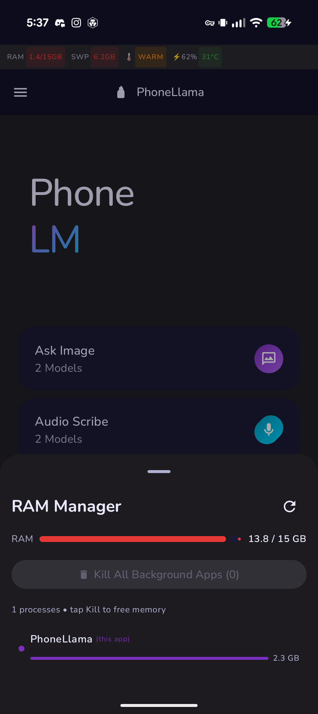

# PhoneLlama

**Turn your Android phone into a GPU-accelerated local inference host.**

PhoneLlama is a fork of [Google AI Edge Gallery](https://github.com/google-ai-edge/ai-edge-gallery) that keeps the full native on-device accelerated inference path, adds better model management, and exposes a local **OpenAI-compatible REST API** that any standard client (Open WebUI, DeerFlow, LM Studio, Jan, curl) can call over localhost or the local network.

---

## Why PhoneLlama

Google AI Edge Gallery demonstrates excellent on-device inference using the LiteRT runtime with GPU delegation — often faster than CPU-bound `llama.cpp` builds in Termux. PhoneLlama builds on that foundation and adds:

- **OpenAI-compatible HTTP API** — `/v1/chat/completions`, `/v1/models`, streaming SSE
- **Easier model management** — curated catalog of verified working models, one-tap activation
- **Local network serving** — optional LAN exposure with ZeroTier VPN support for remote access
- **Server status UI** — active model, request count, server controls, thermal warnings
- **Web status page** — browse the server at `http://PHONE-IP:8888/` from any browser
- **Stability fixes** — smart context trimming prevents the native KV-cache overflow crash present in upstream, foreground service keeps inference alive in the background

---

## Screenshots



---

## Requirements

- Android 10+ device with a decent GPU (tested on Pixel Fold)
- 6 GB RAM minimum; 12 GB recommended for larger models
- Android Studio or `./gradlew assembleDebug` to build

---

## Build

```bash
# Clone
git clone https://github.com/thebitcoinman/phonellama.git
cd phonellama

# Create local.properties pointing at your Android SDK
echo "sdk.dir=/path/to/your/Android/Sdk" > local.properties

# Build debug APK
export JAVA_HOME=/path/to/jdk-21   # JDK 17+ required
./gradlew assembleDebug

# Install
adb install -r app/build/outputs/apk/debug/app-debug.apk
```

---

## Usage

### 1. Download a model

Open the **Models** tab and download one of the listed models. Recommended for most use cases:

| Model | Size | Best for |
|---|---|---|
| Qwen2.5-1.5B-Instruct | ~1 GB | Speed — great for agent tool-calling |
| Qwen3-0.6B | ~585 MB | Smallest, fast with `/no_think` |
| Phi-4-Mini-Instruct | ~3.6 GB | Best reasoning quality (12 GB RAM) |

### 2. Activate a model

Tap a downloaded model → **Set Active**. The API server immediately routes to it.

### 3. Start the API server

Open the **Server** tab → toggle **Enable API Server**.

- Default: `localhost:8888` only
- Enable **LAN mode** to expose on your local network
- The screen shows the exact URL and sample snippets

### 4. Make API calls

```bash
# List models
curl http://127.0.0.1:8888/v1/models

# Chat completion
curl http://127.0.0.1:8888/v1/chat/completions \
  -H "Content-Type: application/json" \
  -d '{
    "model": "Qwen2.5-1.5B-Instruct",
    "messages": [{"role": "user", "content": "Hello!"}]
  }'

# Streaming
curl http://127.0.0.1:8888/v1/chat/completions \
  -H "Content-Type: application/json" \
  -d '{"model": "Qwen2.5-1.5B-Instruct", "messages": [{"role":"user","content":"Hello"}], "stream": true}'
```

### 5. Web status page

Browse to `http://PHONE-IP:8888/` (or `http://127.0.0.1:8888/` via ADB forward) for a live status dashboard.

---

## API Reference

All endpoints are OpenAI-compatible.

### `GET /v1/models`

Returns the list of installed, working models.

```json
{
  "object": "list",
  "data": [
    {"id": "Qwen2.5-1.5B-Instruct", "object": "model", "owned_by": "edge-host", "active": true}
  ]
}
```

### `POST /v1/chat/completions`

Standard OpenAI chat completions. Supports:
- `messages` array (full conversation history, as DeerFlow / LangChain send)
- `stream: true` for SSE streaming
- `max_tokens` override
- `tools` array for function-calling (returned as structured JSON from the model)

### `POST /activate`

Switch the active model without restarting the server.

```bash
curl -X POST http://127.0.0.1:8888/activate \
  -H "Content-Type: application/json" \
  -d '{"model": "Phi-4-Mini-Instruct"}'
```

### `GET /health`

Returns `{"status": "ok", "model": "..."}`.

### `GET /` or `GET /ui`

Returns the HTML status dashboard.

---

## Connecting external clients

### Open WebUI / LM Studio / Jan

Set the base URL to `http://PHONE-IP:8888/v1`. Leave API key blank or use `phonellama`.

### DeerFlow (YAML config)

```yaml
models:
  - name: phone_llama
    display_name: PhoneLlama on-device
    use: langchain_openai:ChatOpenAI
    model: phonellama
    api_key: phonellama
    base_url: http://PHONE-IP:8888/v1
```

### Remote access via ZeroTier

1. Install [ZeroTier](https://play.google.com/store/apps/details?id=com.zerotier.one) on the phone and join your network
2. In PhoneLlama Server tab, enable **LAN mode**
3. Use the ZeroTier IP shown in the app as the base URL

PhoneLlama detects ZeroTier status and shows a red banner + notification if the VPN drops.

---

## Architecture

```
┌──────────────────────────────────────────────────────┐
│                  PhoneLlama App                      │
│                                                      │
│  ┌──────────────┐   ┌──────────────────────────┐    │
│  │  Model UI    │   │  EdgeServer (NanoHTTPD)  │    │
│  │  (Jetpack    │   │  /v1/chat/completions    │    │
│  │   Compose)   │   │  /v1/models              │    │
│  └──────┬───────┘   └──────────┬───────────────┘    │
│         │                      │                    │
│  ┌──────▼──────────────────────▼───────────────┐    │
│  │          ModelManagerViewModel               │    │
│  │   model registry · download · activation    │    │
│  └──────────────────────┬──────────────────────┘    │
│                          │                          │
│  ┌───────────────────────▼──────────────────────┐   │
│  │    LiteRT / Google AI Edge Runtime (JNI)     │   │
│  │    GPU-delegated inference · KV cache        │   │
│  └──────────────────────────────────────────────┘   │
└──────────────────────────────────────────────────────┘
```

Key files added on top of upstream Edge Gallery:

| File | Purpose |
|---|---|
| `edgeserver/EdgeServer.kt` | NanoHTTPD server, OpenAI routing, smart context trimming |
| `edgeserver/EdgeServerManager.kt` | Lifecycle, ZeroTier detection, notifications |
| `edgeserver/EdgeServerScreen.kt` | Server tab UI, ZeroTier banner |
| `edgeserver/EdgeServerService.kt` | Foreground service for background inference |
| `data/PhoneLlamaCatalog.kt` | Curated extended model catalog |
| `ui/common/DeviceStatsBar.kt` | RAM/CPU/thermal overlay |
| `ui/rammanager/RamManagerSheet.kt` | Memory management controls |

---

## Known limitations

- **One model active at a time** — switching models takes 5–15 seconds
- **No embeddings endpoint** — not yet mapped from the LiteRT runtime
- **No tool execution** — the model returns structured tool-call JSON; the client executes tools
- **Crash in `liblitertlm_jni.so`** — mitigated via smart context trimming (see `EdgeServer.kt`); if you encounter a crash, reduce max context or report with logcat output

---

## Differences from upstream Edge Gallery

| Feature | Edge Gallery (upstream) | PhoneLlama |
|---|---|---|
| API server | ❌ | ✅ OpenAI-compatible |
| Model catalog | Google's curated list | Extended with community LiteRT-LM models |
| App name / branding | Google AI Edge Gallery | PhoneLlama |
| Background serving | ❌ | ✅ Foreground service |
| Network status | ❌ | ✅ ZeroTier detection + alerts |
| Web status UI | ❌ | ✅ at `http://PHONE-IP:PORT/` |
| Context overflow fix | ❌ (crashes) | ✅ Smart message trimming |
| RAM manager | ❌ | ✅ |
| Package ID | `com.google.ai.edge.gallery` | `com.phonellama.app` |

---

## Contributing

PRs welcome. Particularly interested in:
- Additional verified LiteRT-LM models for the catalog
- Embeddings endpoint once LiteRT exposes the API
- iOS port if LiteRT supports it

Please test on-device before submitting model additions.

---

## Voice Assistant + Tiered Orchestrator

PhoneLlama can route voice commands through three tiers:

| Tier | Handler | Model |
|---|---|---|
| Simple (greetings, math, lookups) | On-phone | Gemma-4-E2B-it |
| Medium (summarize, explain) | On-phone | Gemma-4-E4B-it |
| **Weather / forecast** | **On-phone (live API)** | **Open-Meteo** — no API key |
| Complex (code gen, long reasoning) | Proxmox orchestrator | Ollama on NixOS VM (qwen3:30b-a3b, CPU) |
| News, stocks, live scores | Proxmox orchestrator | Ollama + tools (extend orchestrator) |
| "use claw …" / "ask claw …" | OpenClaw agent on NixOS VM | Web search, browser, skills (slower) |

### Setup

1. Download **Gemma-4-E2B-it** and/or **Gemma-4-E4B-it** from the Models tab (Gemma-4-E4B is auto-downloaded on first launch).
2. Open **Voice Assistant** from the home drawer.
3. Enable Voice Assistant (pre-loads E2B for instant simple responses).
4. Choose orchestrator mode: **Phone-first** (recommended), Phone-only, or Remote-only.
5. Deploy the Proxmox orchestrator for complex-tier queries — see [orchestrator/README.md](orchestrator/README.md) for the self-contained NixOS VM deployment (Ollama + orchestrator via `docker-compose.proxmox.yml`).

Set the orchestrator URL on the Voice Assistant screen (default `http://100.69.62.49:8081` — the NixOS VM over Tailscale; use `http://192.168.1.100:8081` if the phone is on that LAN).

### Push-to-talk and wake word

- **Push-to-talk**: hold the mic button on the Voice Assistant screen (uses Android speech recognition in PR1).
- **Wake phrase** (offline): download the Vosk model, set a wake phrase (default `hey llama`), and enable wake phrase listening. Uses Vosk grammar mode — fully offline, no third-party API keys.

**Weather:** Ask e.g. *"What's the weather in Seattle?"* — routed to [Open-Meteo](https://open-meteo.com/) on the phone (needs internet, no API key). If you omit a city, defaults to San Francisco. Works in all orchestrator modes including Phone-only.

---

## License

Apache 2.0 — same as [Google AI Edge Gallery](https://github.com/google-ai-edge/ai-edge-gallery).

PhoneLlama is an independent fork and is not affiliated with or endorsed by Google.
